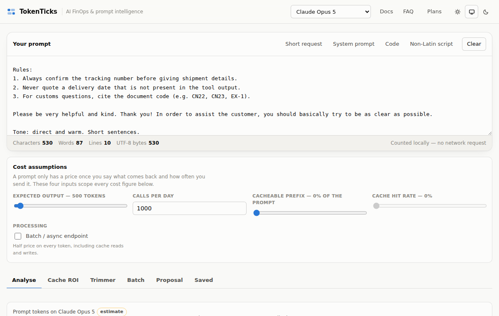
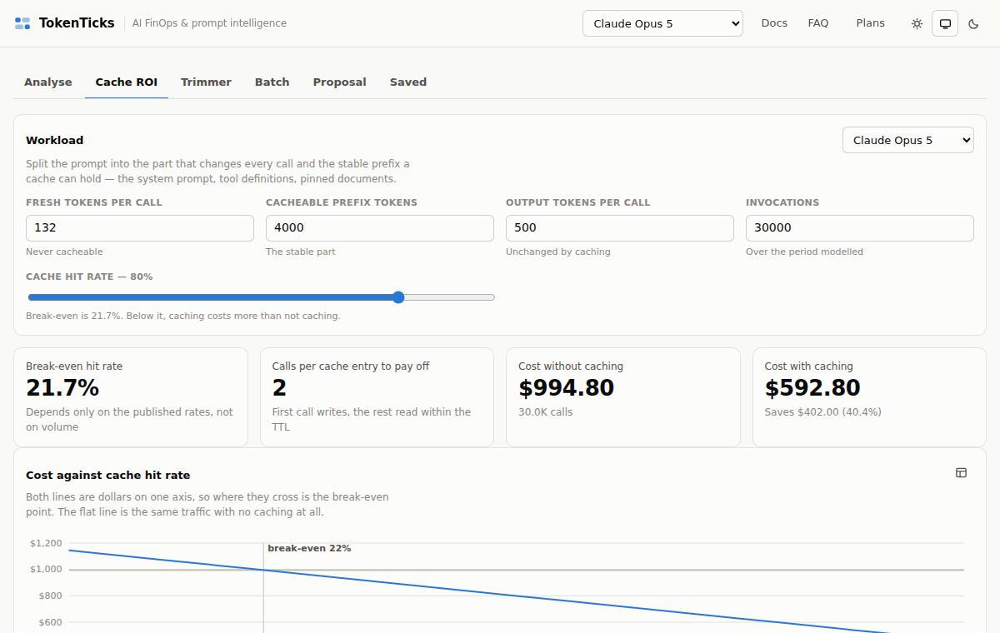
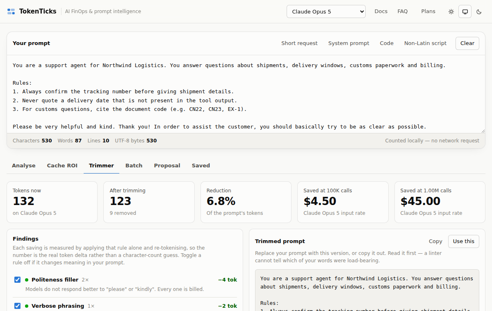
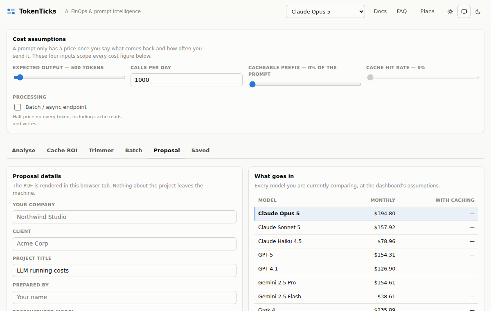

# TokenTicks

**Product guide and marketing playbook**

*Know what every prompt costs before you ship it.*

September 2026 · https://shekath.github.io/Tokenlens/

---

## Contents

- [1. TokenTicks at a glance](#1-tokenticks-at-a-glance)
- [2. The problem TokenTicks solves](#2-the-problem-tokenticks-solves)
- [3. What TokenTicks does](#3-what-tokenticks-does)
- [4. Who it is for, and what they get](#4-who-it-is-for-and-what-they-get)
- [5. Proof in numbers: worked examples](#5-proof-in-numbers-worked-examples)
- [6. Plans and pricing](#6-plans-and-pricing)
- [7. Why people can trust it](#7-why-people-can-trust-it)
- [8. Messaging kit](#8-messaging-kit)
- [9. Social media kit](#9-social-media-kit)
- [10. Advertising kit](#10-advertising-kit)
- [11. Four-week launch calendar](#11-four-week-launch-calendar)
- [12. Visual and brand guide](#12-visual-and-brand-guide)
- [13. Claims checklist for marketers](#13-claims-checklist-for-marketers)
- [14. Links and calls to action](#14-links-and-calls-to-action)

---

## 1. TokenTicks at a glance

**TokenTicks shows what an AI prompt will cost before you ship it, then helps you pay less for it.** Paste a prompt and see its token count and its price on 70 commercial AI models from nine companies, side by side. Then find the waste: tokens you pay for by accident, a prompt cache that is quietly missing, a model that costs fifteen times more than one that would do the job.

It runs in the browser, and your prompt never leaves it. The same engine runs in a terminal, in CI, and inside AI coding tools such as Codex, Gemini CLI, VS Code, Claude Code and Cursor.

| At a glance |   |
| --- | --- |
| What it is | AI cost analytics and prompt optimisation ("AI FinOps") for anyone who pays for AI API calls |
| Models priced | 70 commercial models from OpenAI, Anthropic, Google, xAI, DeepSeek, Mistral, Meta, Cohere and Alibaba |
| Prices | Published list prices, checked every day against a public price list |
| Privacy | Prompts are counted in your browser and never uploaded. No ad or analytics trackers. |
| Where it runs | Web app, command line, CI pipelines, and as an MCP server inside AI coding assistants |
| Plans | Hobby: free forever · Pro: $12/month or $99/year · Team: $39/month |
| Try it | https://shekath.github.io/Tokenlens/ |

> **The one-line pitch:** Know what every prompt costs before you ship it, and stop paying for tokens you do not need.

## 2. The problem TokenTicks solves

AI features are billed by the token, and almost nobody knows their numbers until the invoice arrives.

- **Model choice is guesswork.** The same prompt can cost more than ten times as much on one model as on another that does the job just as well. Most teams pick a model from a leaderboard, not a price sheet.
- **Waste hides in plain sight.** Production prompts collect politeness, repeated rules and decorative formatting. None of it improves the answer, and all of it is billed on every call.
- **Caching fails silently.** Prompt caching can cut input costs by up to 90%, but one timestamp or user name at the top of a prompt stops it working, and nothing tells you.
- **Estimates never meet the invoice.** A proposal says one thing, the bill says another, and nobody can explain the difference.
- **Vendor calculators only price their own models.** Comparing OpenAI with Anthropic with Google means three tabs and a spreadsheet.

A few wasted tokens per call is rounding. A few wasted tokens across a million calls a month is a budget line. TokenTicks makes that line visible and gives you the tools to shrink it.

## 3. What TokenTicks does

Every capability below is live in the product today. The plan that includes it is shown on each one.



*The dashboard: paste a prompt, set your volume, and every figure updates live.*

### Token counter and cost dashboard (every plan)

Paste any prompt and get its tokens, characters, words, lines and bytes, counted locally. Set four assumptions (answer length, calls per day, how much of the prompt can be cached, and your cache hit rate) and see cost per call, per day and per month.

- **Exact for OpenAI:** uses the real tokenisers (o200k_base and cl100k_base).
- **Honest for everyone else:** estimated from measured per-family factors, and clearly labelled "estimate" on every figure.
- **No account needed** to count tokens, as often as you like.

### The full model registry (Pro)

All 70 models across nine companies, each with its published input, output and cache rates, and batch discounts where the vendor offers them. Search by name and filter by company. Prices are checked every day, so new models and price changes show up without you doing anything.

### Cache ROI simulator (Pro)

Writing to a prompt cache costs more than an ordinary input token, and reading from it costs much less. Whether caching pays depends on your hit rate, and the break-even is not where most people guess: around 22% at Anthropic's published rates. The simulator computes the break-even for any model with cache pricing and shows cost curves from a hundred to a million calls, before you build anything.



*Cache ROI: the break-even hit rate and the cost either side of it.*

### Cache order linter (Pro)

Finds the reason a prompt cache that should be hitting is not. It flags values that change on every call (timestamps, request IDs, {{user_name}} placeholders), measures the stable tokens they lock out of the cache, prices the loss at your volume, and suggests a reordered prompt with whole blocks moved, never split.

### Token Trimmer (Pro)

Eight rules find the tokens you pay for by accident: politeness filler, hedging, duplicated rules, decorative markdown and more. Every suggestion is re-tokenised to measure what it actually saves, then priced per call, at 100,000 calls and at a million. You see the cleaned prompt next to the original, and nothing changes until you accept it.



*Token Trimmer: each finding measured in real tokens, and priced at scale.*

### Batch forecasting (Pro: 10,000 rows · Team: unlimited)

Drop in the CSV or JSONL file you are about to run through a model and see what the whole job will cost on every model you are considering, including batch-endpoint pricing (typically half price). The file is read in your browser and never uploaded. Export the forecast to CSV.

### PDF cost proposals (Pro · white-label on Team)

Turn a comparison into a branded PDF with your company and your client on the cover: projected monthly spend, the recommended model, the alternatives, and every assumption behind the number. Generated in your browser. Team removes the TokenTicks branding completely.



*A client-ready cost proposal, generated in the browser.*

### Spend reconciliation (Team)

Drop in a usage export from your AI provider and set it against the estimates you saved. TokenTicks splits the difference into a volume effect (more or fewer calls than planned) and a per-call effect (each call cost more or less), and names the causes, largest first. The export never leaves your browser.

### Custom rate cards and share links (Team)

Add rates for fine-tuned, self-hosted or negotiated-price models and price everything against what you actually pay. Share a saved estimate by link: the link shows the title, model and cost, never the prompt. That rule is enforced in the database, not just hidden in the interface.

### CLI, CI checks and MCP server (every plan, more on Pro and Team)

The tokenticks command-line tool (npm install -g tokenticks) runs the same engine where prompts actually live:

- **In a terminal:** count and price any prompt file.
- **In CI:** set a token or monthly-cost budget per prompt file, and fail the build when a change blows it. Pro adds Trimmer and cache-order checks as pull-request annotations with a dollar figure on each. Team adds team-wide rules and a comment on every pull request with its monthly cost change.
- **Inside AI assistants (MCP):** Codex, Gemini CLI, VS Code, Claude Code, Cursor and Claude Desktop can answer "what does this prompt cost on a cheaper model?" mid-conversation.
- **Private:** prompts are read and counted on your machine. The only network call is a licence check, cached for 12 hours, and a licence problem never fails your build.

## 4. Who it is for, and what they get

| Who | Their problem | What TokenTicks gives them | Best plan |
| --- | --- | --- | --- |
| Students and hobbyists | Want to learn how tokens and pricing work without a credit card | Unlimited token counting and five major models priced, free | Hobby |
| Indie hackers and solo founders | Every dollar of API spend comes out of their own pocket | The cheapest model that does the job, and a trimmed prompt | Pro |
| Prompt engineers | Need to prove a prompt change saves money, not just claim it | Measured savings per change, cache diagnostics, CI checks | Pro |
| Freelancers and AI consultants | Clients ask "what will this cost to run?" | Branded PDF proposals with the assumptions printed | Pro / Team |
| SaaS startups | AI costs grow faster than revenue | Budgets in CI, cost diffs on every pull request, reconciliation against real bills | Team |
| Dev shops and agencies | Quote many clients, many models, some self-hosted | Custom rate cards, white-label proposals, share links | Team |
| Finance and engineering leads | Estimates and invoices never match | Variance split into volume and per-call causes | Team |

## 5. Proof in numbers: worked examples

These examples use published list prices on 24 September 2026 and simple, stated assumptions. They show the kind of saving TokenTicks exposes. Your own numbers will differ, which is exactly why the tool exists.

#### Example 1: the same job, 15 times cheaper

A support assistant sends a 2,000-token prompt and gets a 400-token answer, 100,000 times a month.

| Model | Input cost | Output cost | Monthly total |
| --- | --- | --- | --- |
| Claude Opus 5 | $1,000 | $1,000 | $2,000 |
| Claude Sonnet 5 | $400 | $400 | $800 |
| Claude Haiku 4.5 | $200 | $200 | $400 |
| GPT-5 mini | $50 | $80 | $130 |

If a smaller model passes your quality tests, the difference is up to $1,870 a month. TokenTicks puts all 70 models side by side, so you can see this in seconds.

#### Example 2: caching that works, and caching that silently does not

A 3,000-token system prompt on Claude Sonnet 5, 100,000 calls a month:

- **Without caching:** $600 a month for those tokens.
- **With caching at a 90% hit rate:** about $129 a month.
- **With a timestamp on the first line:** the cache never hits, and you pay the full $600 while believing caching is on.

The Cache order linter finds that timestamp, measures the loss (about $471 a month here) and shows the fix.

#### Example 3: trimming pays for the plan many times over

Trimming just 150 wasted tokens from a prompt that runs a million times a month on Claude Sonnet 5 saves $300 a month, or $3,600 a year. Pro costs $99 a year.

> **The payback rule:** Pro pays for itself when it saves about 6 million input tokens a month on a mid-range model. That is 60 tokens per call at 100,000 calls a month: often a single paragraph of politeness or repeated instructions.

## 6. Plans and pricing

|   | Hobby | Pro | Team |
| --- | --- | --- | --- |
| Price | Free forever | $12/month, or $99/year (save 31%) | $39/month |
| For | Students and casual experimenters | Indie hackers, prompt engineers, freelancers | Dev shops, SaaS startups, AI consultancies |
| Models | Top 5 foundational models | All 70 commercial models, updated daily | All models plus custom rate cards |
| Prompt caching | Baseline uncached cost | Break-even and ROI simulator; cache-order linter | Plus cache TTL lifecycle and multi-turn agents |
| Batch | Single prompt | CSV / JSONL up to 10,000 rows | Unlimited |
| Optimisation | Character and word counts | Token Trimmer with measured savings | Team-wide rules |
| Exports | Copy as Markdown | Branded PDF proposals and CSV | White-label proposals and share links |
| CLI and MCP | Token counts and costs, 5 models | Plus Trimmer and cache-order checks | Plus team rules and pull-request cost diffs |
| Spend tracking | Estimates only | Estimates only | Reconcile estimates against real usage |
| Saved estimates | 3 | Unlimited | Unlimited |

#### Which plan should you choose?

- **Choose Hobby** if you want to learn, or you only need a token count now and then.
- **Choose Pro** if you pay for AI calls yourself or for a client. One avoided mistake, such as the wrong model, a broken cache or a bloated prompt, usually covers a year of Pro. The annual plan is the best value at $8.25 a month.
- **Choose Team** if AI runs in production, several people change prompts, or you answer to someone about the bill. CI cost diffs and reconciliation catch overspend before and after it happens.

Billing is handled by Lemon Squeezy as merchant of record, so VAT, GST and sales tax are calculated at checkout. Cancel any time; your plan runs to the end of the period you paid for. Payments are non-refundable except where the law of your country requires a refund.

## 7. Why people can trust it

- **Your prompts stay yours.** Counting and pricing happen in your browser. Batch files and usage exports are read locally and never uploaded. The CLI and MCP server run on your own machine.
- **No trackers.** No advertising or analytics scripts, no third-party fonts.
- **Honest numbers.** Exact counts are labelled exact; estimates are labelled estimates. Every figure carries its assumptions.
- **Current prices.** Prices are checked daily against a public list; unusual changes are held for human review instead of being applied blindly.
- **Secure accounts.** Row-level security in the database, licence keys stored only as hashes, and payment cards handled only by Lemon Squeezy.
- **Clear policy.** A full privacy policy covering India's DPDP Act, GDPR, US state laws and more, published in eight languages.

---

## 8. Messaging kit

### Taglines

- Know what every prompt costs before you ship it.
- Stop paying for tokens you do not need.
- AI costs, counted before they count against you.
- Every model. Every price. One prompt.
- Your AI bill, explained.

### Elevator pitches

**10 words**

```text
See what any AI prompt costs on 70 models, instantly.
```

**30 words**

```text
TokenTicks prices your AI prompts on 70 models from nine companies, side by side, then finds the waste: bloated prompts, broken caching and overpriced models. Your prompt never leaves your browser.
```

**100 words**

```text
AI features are billed by the token, and most teams only learn the real cost when the invoice arrives. TokenTicks fixes that. Paste a prompt and see its price on 70 models from OpenAI, Anthropic, Google and six more companies. The Token Trimmer finds text you pay for on every call without benefit. The cache linter shows why prompt caching is not saving you money. Batch forecasts price a whole dataset before you run it, and branded PDF proposals turn the numbers into something a client can sign. It works in your browser, your terminal, your CI pipeline and your AI coding assistant, and your prompts never leave your machine.
```

### Key messages and the proof behind them

| Message | Proof point you can quote |
| --- | --- |
| Compare every major model at once | 70 models, nine companies, one prompt, side by side |
| Stop paying for waste | Eight Trimmer rules; every saving measured in real tokens and priced at a million calls |
| Make caching actually pay | Break-even computed per model (about 22% hit rate at Anthropic list prices); cache-breaking values found automatically |
| Know the cost before you run it | Batch forecasts for CSV / JSONL files up to 10,000 rows on Pro, unlimited on Team |
| Win client trust | Branded, and on Team white-label, PDF proposals with every assumption printed |
| Catch overspend in code review | CI budgets and pull-request cost diffs |
| Private by design | Prompts counted in the browser; no trackers; CLI runs locally |
| Always current | Prices checked every day |

### Answering common objections

| They say | You say |
| --- | --- |
| "The vendor already has a pricing calculator." | Each vendor prices only its own models, and none of them tells you your prompt is bloated or your cache is broken. TokenTicks compares all of them on your real prompt. |
| "I can do this in a spreadsheet." | You can, until prices change, a new model launches, or you need cache and batch maths. TokenTicks updates daily and does that maths for you. |
| "I don't want to paste confidential prompts into a website." | You are right not to. TokenTicks counts in your browser and never uploads the prompt, and the CLI runs entirely on your machine. |
| "Our AI spend is small." | Then start free. Pro only needs to find about $12 of waste a month, often one paragraph of a busy prompt, to pay for itself. |
| "Are the counts accurate?" | Exact for OpenAI models, using their own tokenisers. Other vendors are estimated from measured factors and clearly labelled, so you always know which is which. |

---

## 9. Social media kit

Ready-to-post copy for each platform. Replace the link with a tracked link (for example, with UTM tags) before posting, and add one of the product screenshots or a short screen recording. Posts with a real number in the first line tend to stop the scroll.

### LinkedIn

**Post 1: the problem**

```text
Most teams choose an AI model from a leaderboard, not a price sheet.

We priced one support-bot prompt (2,000 tokens in, 400 out, 100,000 calls a month) at list prices:

• Claude Opus 5: $2,000/month
• Claude Sonnet 5: $800/month
• Claude Haiku 4.5: $400/month
• GPT-5 mini: $130/month

Same job. Up to 15× difference.

If a smaller model passes your quality bar, that gap is pure savings. TokenTicks shows it for your own prompt across 70 models in seconds, and your prompt never leaves your browser.

Try it free: https://shekath.github.io/Tokenlens/

#AI #LLM #FinOps #AIEngineering #CostOptimization
```

**Post 2: the silent cache failure**

```text
Prompt caching can cut input costs by up to 90%.

But put a timestamp, a request ID or "Hello {{user_name}}" on the first line of your system prompt and the cache never hits. Nothing errors. The bill just stays high.

On a 3,000-token prompt at 100,000 calls a month, that is roughly $600 instead of $129 on Claude Sonnet 5.

TokenTicks' cache-order linter finds the values that break your cache, prices the loss at your volume, and suggests the reordered prompt.

https://shekath.github.io/Tokenlens/

#PromptEngineering #LLMOps #AI #DevTools
```

**Post 3: for consultants**

```text
"What will this AI feature cost to run?"

Every AI consultant hears it. Most answer with a guess.

With TokenTicks you answer with a branded PDF: projected monthly spend, recommended model, the alternatives, and every assumption printed next to the number. Generated in your browser, so your client's prompt stays private.

Pro is $12/month. It pays for itself on the first proposal.

https://shekath.github.io/Tokenlens/

#AIConsulting #Freelance #GenAI #Proposals
```

### X (Twitter)

**Tweet 1** *(199 characters)*

```text
Same prompt. Same job.

Claude Opus 5: $2,000/mo
GPT-5 mini: $130/mo

(2k tokens in, 400 out, 100k calls, list prices)

See the gap for your own prompt across 70 models, free: https://shekath.github.io/Tokenlens/
```

**Tweet 2** *(187 characters)*

```text
Your prompt cache isn't failing loudly. It's failing silently.

One timestamp on line 1 and nothing after it ever caches.

TokenTicks finds it and prices the loss: https://shekath.github.io/Tokenlens/
```

**Tweet 3** *(235 characters)*

```text
"Please", "kindly", "thank you" in a system prompt: the model doesn't care, but you pay for them on every call.

At 1M calls/month, 150 wasted tokens = $300/month on Sonnet 5.

Find yours with the Token Trimmer: https://shekath.github.io/Tokenlens/
```

**Thread (5 posts)**

```text
1/ AI bills are paid by the token, and most teams have no idea where theirs go. Here are 4 leaks we see again and again. 🧵

2/ The wrong model. The same support prompt costs $2,000/mo on Opus 5 and $130/mo on GPT-5 mini. If the cheaper one passes your evals, that's money for nothing.

3/ Bloated prompts. Politeness, hedging, repeated rules, decorative markdown. Each is billed on every single call.

4/ Broken caching. A timestamp or user name at the top of a prompt means the cache never hits. No error, just a bill.

5/ Guesswork. Estimates that never meet the invoice. TokenTicks finds all four, privately in your browser: https://shekath.github.io/Tokenlens/
```

### Instagram carousel (7 slides)

1. Cover: "Your AI bill has 4 leaks." (bold, large)
2. Leak 1: The wrong model. Same job: $2,000 vs $130 a month.
3. Leak 2: Bloated prompts. "Please" and "kindly" are billed on every call.
4. Leak 3: Broken caching. One timestamp and the cache never hits.
5. Leak 4: Guesswork. Estimates that never match the invoice.
6. The fix: TokenTicks prices 70 models side by side and finds the waste. Screenshot of the Trimmer.
7. CTA: "Count your tokens free. Link in bio." Logo and URL.

**Caption**

```text
4 ways AI features quietly overspend, and how to find each one in a minute. Your prompt never leaves your browser. Free to start, link in bio.

#AI #ArtificialIntelligence #ChatGPT #Claude #Gemini #Developers #Startup #TechTips #FinOps
```

### Short video (Reels, Shorts, TikTok): 30-second script

| Time | On screen | Voice-over |
| --- | --- | --- |
| 0–3s | Big text: "$2,000 or $130?" | "Same AI prompt. Two very different bills." |
| 3–10s | Paste a prompt into TokenTicks; model table fills in | "Paste your prompt and see its price on 70 models at once." |
| 10–18s | Trimmer tab: findings and "Saved at 1M calls" | "The Token Trimmer finds the words you pay for on every call, and what they cost." |
| 18–25s | Cache order: a flagged timestamp | "And it shows why your prompt cache isn't saving you anything." |
| 25–30s | Logo, URL, "Free to start" | "TokenTicks. Know what every prompt costs before you ship it." |

### Facebook

**Post**

```text
Building with AI? Here's a question worth 60 seconds: do you know what each of your prompts costs?

TokenTicks shows the price of any prompt on 70 AI models (OpenAI, Anthropic, Google and more) side by side, then shows you how to cut it. Private by design: your prompt is counted in your browser and never uploaded.

Start free, no account needed: https://shekath.github.io/Tokenlens/
```

### Reddit and Hacker News

These communities reward plain, factual posts from the builder, and punish advertising. Post as yourself, say what you made and why, be open about the paid plans, and answer every comment.

**Show HN / r/SideProject**

```text
Show HN: TokenTicks – see what a prompt costs on 70 LLMs, and where the waste is

I kept getting surprised by AI bills, so I built a tool that prices a prompt across 70 models from 9 vendors side by side, using OpenAI's real tokenisers (other vendors are estimated and labelled as such).

It also finds waste: a linter for filler text (each finding re-tokenised to measure the real saving), a check for values that break prompt caching (timestamps and IDs early in a prompt), and batch forecasts for CSV/JSONL files. Everything is counted client-side; prompts are never uploaded. There's a CLI and MCP server too (npm i -g tokenticks) for CI budgets and for asking your coding assistant what a prompt costs.

Counting is free with no account. Pro and Team plans unlock the full model list and the optimisation tools. Feedback very welcome, especially on the estimates for non-OpenAI tokenisers.

https://shekath.github.io/Tokenlens/
```

### Product Hunt launch

**Tagline (60 characters max)** *(50 characters)*

```text
Know what every AI prompt costs before you ship it
```

**Description**

```text
Price any prompt on 70 AI models side by side, then cut the waste: a Token Trimmer, a prompt-cache linter, batch forecasts, PDF cost proposals, and a CLI and MCP server for CI and your coding assistant. Prompts never leave your browser.
```

**Maker's first comment**

```text
Hi Product Hunt! I built TokenTicks after one too many surprising AI invoices.

Three things it does that vendor calculators don't:
1. Compares 70 models from 9 companies on your real prompt
2. Finds the waste: filler text, cache-breaking values, oversized models
3. Works where prompts live: browser, terminal, CI and MCP

Counting is free forever. I'd love your feedback!
```

### Hashtags

| Use for | Hashtags |
| --- | --- |
| Broad reach | #AI #ArtificialIntelligence #GenAI #LLM #MachineLearning |
| Developers | #DevTools #PromptEngineering #AIEngineering #LLMOps #CLI |
| Cost and finance | #FinOps #CloudCosts #CostOptimization #SaaS #Startups |
| Model names (use sparingly) | #ChatGPT #Claude #Gemini #OpenAI #Anthropic |

---

## 10. Advertising kit

### Google search ads (responsive search ad)

Headlines are up to 30 characters and descriptions up to 90. Every line below is within the limit.

**Headlines** (max 30 characters)

| # | Text | Characters |
| --- | --- | --- |
| 1 | AI Prompt Cost Calculator | 25 |
| 2 | Price 70 AI Models at Once | 26 |
| 3 | Cut Your LLM API Costs | 22 |
| 4 | Free Token Counter | 18 |
| 5 | Compare GPT, Claude & Gemini | 28 |
| 6 | Find Wasted Tokens Fast | 23 |
| 7 | Fix Broken Prompt Caching | 25 |
| 8 | Know Costs Before You Ship | 26 |
| 9 | Private: Runs in Your Browser | 29 |
| 10 | Pro From $8.25/Month | 20 |

**Descriptions** (max 90 characters)

| # | Text | Characters |
| --- | --- | --- |
| 1 | See what any prompt costs on 70 AI models side by side. Free to start, no signup needed. | 88 |
| 2 | Find wasted tokens, broken caching and overpriced models. Prompts stay in your browser. | 87 |
| 3 | Batch forecasts, PDF cost proposals, CI budgets and an MCP server for your AI assistant. | 88 |
| 4 | Exact OpenAI token counts, clearly labelled estimates for 8 more AI companies. | 78 |

Google may disapprove ad text that uses a trademark such as GPT, Claude or Gemini. If headline 5 is rejected, pause it; the other headlines carry the message on their own.

#### Keywords to bid on

- Core: token counter, LLM cost calculator, AI API cost calculator, prompt token counter, OpenAI pricing calculator, Claude API cost, Gemini API pricing
- Problem: reduce LLM costs, reduce OpenAI API costs, prompt caching cost, LLM cost optimization
- Comparison: GPT vs Claude cost, cheapest LLM API, compare LLM pricing
- Negative keywords: free ChatGPT, ChatGPT login, jobs, course, salary

### LinkedIn sponsored content

**Introductory text (150 characters max)** *(112 characters)*

```text
Your AI bill has leaks: the wrong model, bloated prompts, broken caching. TokenTicks finds all three, privately.
```

**Headline (70 characters max)** *(50 characters)*

```text
Know what every AI prompt costs before you ship it
```

**Audience:** job titles such as Software Engineer, ML Engineer, CTO, Head of Engineering, Engineering Manager, Product Manager (AI), and FinOps; company size 11–500; interests in artificial intelligence and cloud computing. **Call to action:** "Try free" or "Learn more".

### Meta (Facebook and Instagram) ads

**Primary text (125 characters recommended)** *(105 characters)*

```text
Same AI prompt: $2,000/month on one model, $130 on another. See the gap for yours across 70 models, free.
```

**Headline (40 characters recommended)** *(25 characters)*

```text
Count your AI costs, free
```

**Creative:** the Example 1 table as a bold graphic, or the 30-second video. **Audience:** interests in OpenAI, ChatGPT, software development, startups and SaaS; retarget site visitors with the Pro annual offer.

### Retargeting and email

- **Visited but did not sign up:** "Counting is free, no account needed. Come back and price your prompt on 70 models."
- **Free users:** "You priced 5 models. Pro opens all 70, plus the Trimmer that finds what you are overpaying for. $99/year."
- **Pro users approaching Team:** "Put a cost budget on every pull request, and reconcile estimates against your real bill."

## 11. Four-week launch calendar

| Week | Theme | Posts and actions |
| --- | --- | --- |
| 1 | Awareness: "Your AI bill has leaks" | LinkedIn post 1; X thread; Instagram carousel; short video; start Google search ads on core keywords |
| 2 | Education: caching and waste | LinkedIn post 2; tweets 2 and 3; a blog post walking through Example 2; Reddit or Show HN post |
| 3 | Proof: numbers and use cases | LinkedIn post 3 (consultants); a case walkthrough video; Product Hunt launch day; LinkedIn sponsored campaign |
| 4 | Conversion: plans | Pro annual offer to free users; retargeting ads; Team message to engineering leads; recap of results and feedback |

## 12. Visual and brand guide

- **Name:** TokenTicks (one word, two capital Ts).
- **Tagline:** "Know what every prompt costs before you ship it."
- **Primary colour:** blue #2A78D6. Accents: orange #EB6834 and green #1BAF7A. Text: near-black #0B0B0B on off-white #FCFCFB.
- **Imagery:** real product screenshots (dashboard, Trimmer, Cache ROI, PDF proposal) in light or dark mode. Show real numbers, not stock photos.
- **Voice:** plain, specific and honest. Lead with a number. Avoid hype words like "revolutionary" or "game-changing".

## 13. Claims checklist for marketers

Keeping claims accurate protects the brand and keeps ads approved.

| Say | Do not say |
| --- | --- |
| "Exact token counts for OpenAI models; clearly labelled estimates for other vendors" | "100% accurate token counts for every model" |
| "Prices checked daily against published list prices" | "Real-time prices" or "guaranteed current prices" |
| "Can cut costs by up to …" with a worked example and its assumptions | "Saves you 90%" with no context |
| "Your prompt is counted in your browser and never uploaded" | "Military-grade security" or "unhackable" |
| "Works with Codex, Gemini CLI, VS Code, Claude Code and Cursor" | "Official partner of OpenAI / Anthropic / Google", or using their logos |
| "Cancel any time; your plan runs to the end of the period" | "Money-back guarantee" |

Model and company names (OpenAI, GPT, Claude, Anthropic, Gemini, Google and others) are trademarks of their owners. Use them only to describe compatibility and price comparisons. Do not suggest endorsement, and do not use their logos without permission. Always date price comparisons ("at list prices on 24 September 2026").

## 14. Links and calls to action

| What | Where |
| --- | --- |
| Web app (free to start) | https://shekath.github.io/Tokenlens/ |
| CLI and MCP server | npm install -g tokenticks |
| Developer setup guide | https://shekath.github.io/Tokenlens/#/devtools |
| Feature docs | https://shekath.github.io/Tokenlens/#/docs |
| FAQ | https://shekath.github.io/Tokenlens/#/faq |
| Privacy Policy | https://shekath.github.io/Tokenlens/#/privacy |

> **Primary call to action:** Count your tokens free. No account needed. Then upgrade to Pro when you find your first saving.

---

*Figures use published list prices on 24 September 2026. Worked examples are illustrative; actual costs depend on your prompts, volumes and model choice.*
